# ENSA Module 4: ACL Concepts

## 4.1. Purpose of ACLs

### What is an ACL?

An ACL (Access Control List) is a set of IOS commands used to filter packets based on information found in the packet header.

- By default, there are no ACLs configured on a router. When an ACL is applied to an interface, the router filters packets based on the ACL rules.
- **ACE (Access Control Entries)**: These are the individual rules within an ACL. Each ACE specifies a condition that must be met for the packet to be permitted or denied. ACEs are processed in sequential order.
  - Also called ACL statements.

**ACLs perform the following functions:**

- Control traffic flow into and out of a network.
- Provide a basic level of security by filtering traffic based on IP address, protocol, and port number.
- Screen hosts and networks to prevent unauthorized access to network resources.
- Provide priority to certain types of traffic, such as voice or video, by allowing or denying packets based on their characteristics.

### Packet Filtering

Packet filtering refers to analyzing packets as they enter or leave the router:

- **Ingress filtering**: Packets are filtered as they enter the router interface.
- **Egress filtering**: Packets are filtered as they leave the router interface.

Filtering occurs at Layer 3 (Network Layer) and Layer 4 (Transport Layer) of the OSI model.

**Cisco supports two types of ACLs:**

- **Standard ACLs**: Filter packets based on source IP address only (Layer 3).
- **Extended ACLs**: Filter packets based on source and destination IP address, protocol type, and port number (Layer 3 and Layer 4).

### ACL Operation

ACLs do not act on packets originating from the router itself. They only act on packets being routed through the router.

- **Inbound ACL**: Applied to incoming packets on an interface. The ACL is processed before the packet is routed to its destination.
  - The router extracts the source IP address from the packet header.
  - The router compares the source IP address to the ACL rules.
  - If the source IP address matches a rule, the router takes the action specified in the rule (permit or deny), and the remaining rules are ignored.
  - If the source IP address does not match any rule, the router applies the implicit deny rule (deny).
- **Outbound ACL**: Applied to outgoing packets on an interface. The ACL is processed after the packet is routed to its destination, regardless of the inbound interface.

> **Note**: The last rule in an ACL is **implicit deny**. This means that if a packet does not match any of the rules in the ACL, it will be denied by default. Every ACL should have at least one permit rule to allow traffic.

---

## 4.2. Wildcard Masks in ACLs

### Wildcard Mask Overview

Wildcard masks are used in ACLs to specify which bits of an IP address should be matched and which bits should be ignored.

- A wildcard mask is a 32-bit number.
  - **0** in the mask means the corresponding bit in the IP address must match (fixed).
  - **1** in the mask means the corresponding bit in the IP address can be ignored (variable).

#### Examples:

- **Wildcard Mask to Match a Single Host**  
   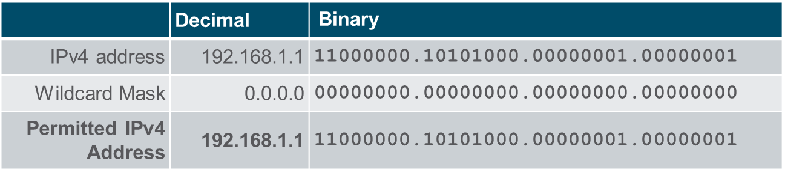

- **Wildcard Mask to Match an IPv4 Subnet**  
   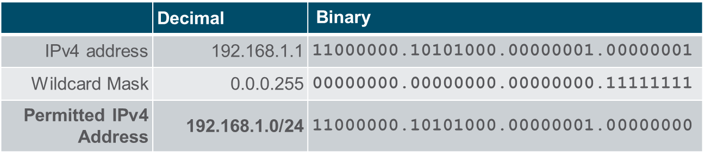

- **Wildcard Mask to Match an IPv4 Address Range**  
   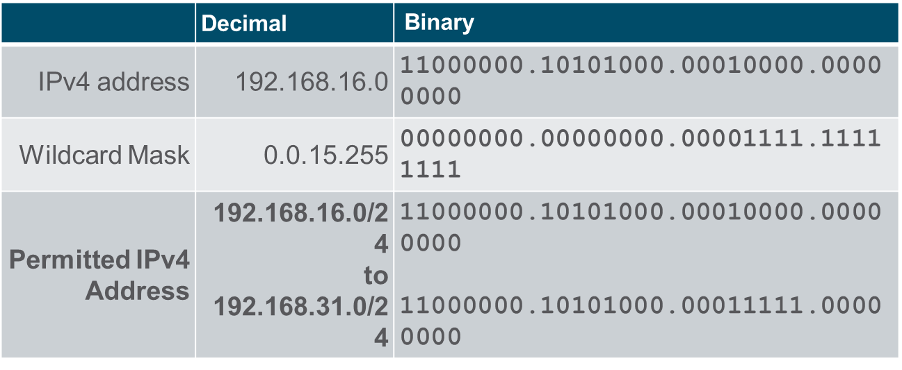

### Wilcard mask calculation

Calculating wildcard masks can be challenging. One shortcut method is to subtract the subnet mask from `255.255.255.255`. Here are some examples:

- **Example 1**:  
   Assume you want an ACE in ACL 10 to permit access to all users in the `192.168.3.0/24` network.  
   To calculate the wildcard mask, subtract the subnet mask (`255.255.255.0`) from `255.255.255.255`.  
   This produces the wildcard mask `0.0.0.255`.  
   The ACE would be:

  ```plaintext
  access-list 10 permit 192.168.3.0 0.0.0.255
  ```

- **Example 2**:  
   Assume you want an ACE in ACL 10 to permit network access for the 14 users in the subnet `192.168.3.32/28`.  
   Subtract the subnet mask (`255.255.255.240`) from `255.255.255.255`.  
   This produces the wildcard mask `0.0.0.15`.  
   The ACE would be:

  ```plaintext
  access-list 10 permit 192.168.3.32 0.0.0.15
  ```

- **Example 3**:  
   Assume you need an ACE in ACL 10 to permit only networks `192.168.10.0` and `192.168.11.0`.  
   These two networks can be summarized as `192.168.10.0/23`, which has a subnet mask of `255.255.254.0`.  
   Subtract the subnet mask (`255.255.254.0`) from `255.255.255.255`.  
   This produces the wildcard mask `0.0.1.255`.  
   The ACE would be:
  ```plaintext
  access-list 10 permit 192.168.10.0 0.0.1.255
  ```

### Wilcard mask keywords

Wildcard masks can be expressed in two ways:

- **Numeric**: The wildcard mask is expressed as a 32-bit number, as in the examples above.

- **Keyword**: The wildcard mask is expressed as a keyword, such as `any`, `host`. The keywords are used to simplify the configuration of ACLs.
  - `any`: Matches any IP address. The wildcard mask is `255.255.255.255`.
  - `host`: Matches a single host. The wildcard mask is `0.0.0.0`.

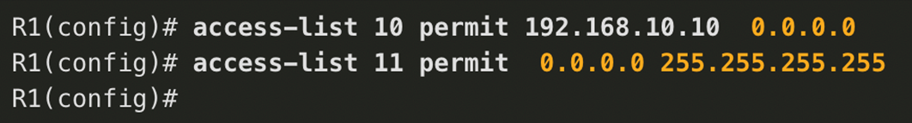
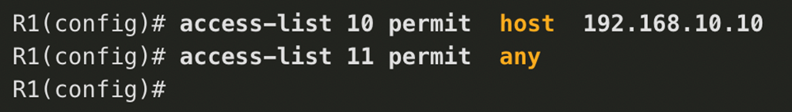

## 4.3. Guidelines for ACL creation

### Limted Number of ACL's per interface

A router interface can have 4 ACL's configured per interface:

- 1 Inbound IPV4 ACL
- 1 Outbound IPV4 ACL
- 1 Inbound IPV6 ACL
- 1 Outbound IPV6 ACL

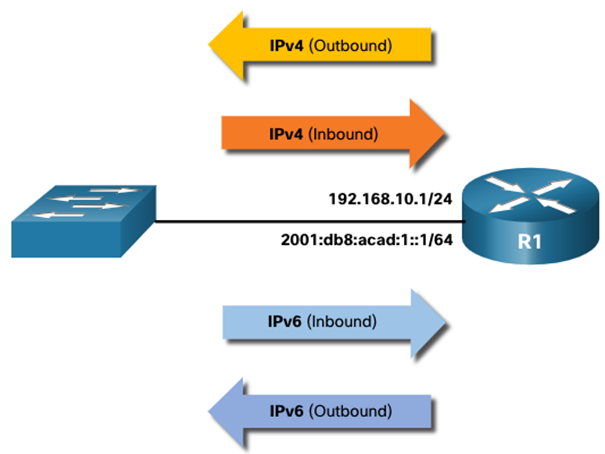

### ACL best practices

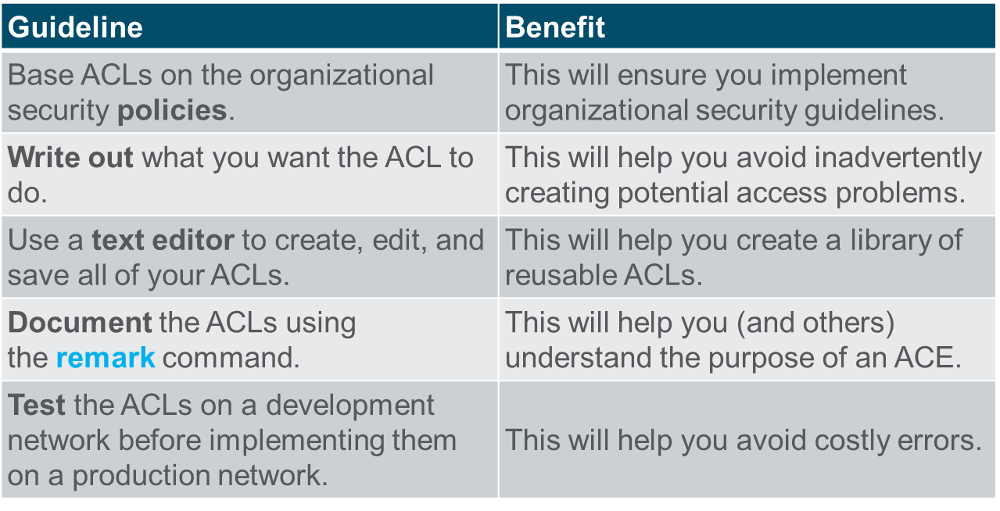

## 4.4. Types of IPv4 ACLs

1. **Standard ACLs**: Filter packets based on source IP address only (Layer 3).  
   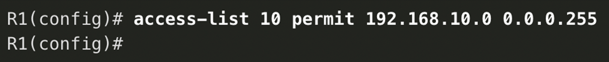

2. **Extended ACLs**: Filter packets based on source and destination IP address, protocol type, and port number (Layer 3 and Layer 4).  
   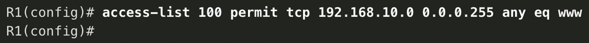

### Numbered and Named ACLs

- **Numbered ACLs**:

  - Standard ACLs: 1-99 and 1300-1999
  - Extended ACLs: 100-199 and 2000-2699

- **Named ACLs**:
  - Preferred method for creating ACLs.
  - Names provide a descriptive way to identify the ACL's purpose.

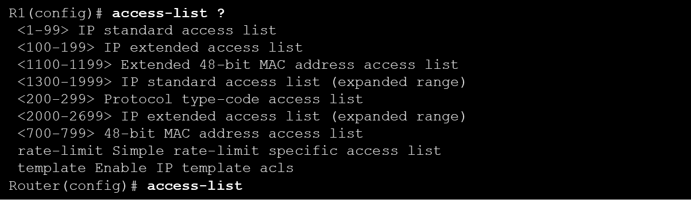

### Where to Place ACLs

- **Standard ACLs**: Place as close to the destination as possible.
- **Extended ACLs**: Place as close to the source as possible.

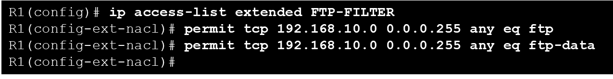

### Where to place ACLs

Every ACL should be place where it has the geatest impact on efficiency and security.

- Standard ACLs should be placed as close to the destination as possible.
- Extended ACLs should be placed as close to the source as possible.

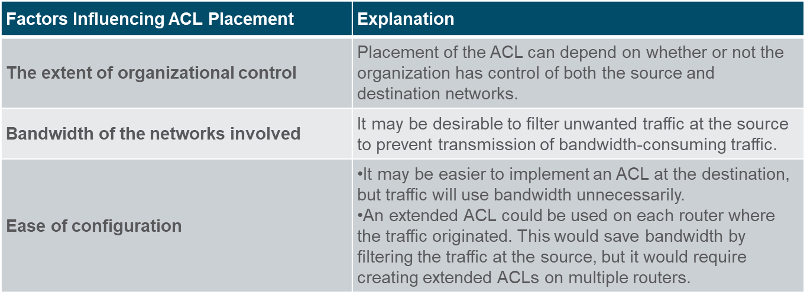

### Standard ACL Placement Example

In the figure, the administrator wants to prevent traffic originating in the `192.168.10.0/24` network from reaching the `192.168.30.0/24` network.

Following the basic placement guidelines, the administrator would place a standard ACL on router R3.

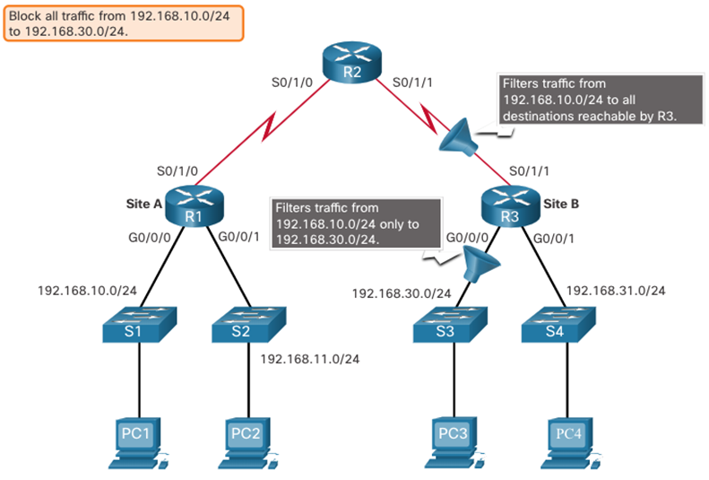

There are two possible interfaces on R3 to apply the standard ACL:

- **R3 S0/1/1 Interface (Inbound)**:  
   The standard ACL can be applied inbound on the R3 S0/1/1 interface to deny traffic from the `.10` network. However, it would also filter `.10` traffic to the `192.168.31.0/24` (`.31` in this example) network. Therefore, the standard ACL should not be applied to this interface.

- **R3 G0/0 Interface (Outbound)**:  
   The standard ACL can be applied outbound on the R3 G0/0/0 interface. This will not affect other networks that are reachable by R3. Packets from the `.10` network will still be able to reach the `.31` network. This is the best interface to place the standard ACL to meet the traffic requirements.

### Extended ACL Placement Example

Extended ACLs should be located as close to the source as possible. However, the organization can only place ACLs on devices that they control. Therefore, the extended ACL placement must be determined in the context of where organizational control extends.

In the figure, for example, Company A wants to deny Telnet and FTP traffic to Company B’s `192.168.30.0/24` network from their `192.168.11.0/24` network, while permitting all other traffic.

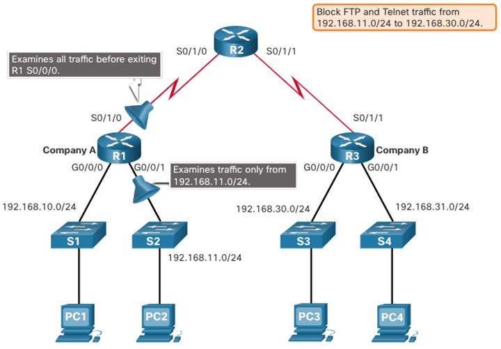

An extended ACL on R3 would accomplish the task, but the administrator does not control R3. In addition, this solution allows unwanted traffic to cross the entire network, only to be blocked at the destination.  
The solution is to place an extended ACL on R1 that specifies both source and destination addresses.

There are two possible interfaces on R1 to apply the extended ACL:

- **R1 S0/1/0 Interface (Outbound)**:  
   The extended ACL can be applied outbound on the S0/1/0 interface. This solution will process all packets leaving R1, including packets from `192.168.10.0/24`.

- **R1 G0/0/1 Interface (Inbound)**:  
   The extended ACL can be applied inbound on the G0/0/1 interface, and only packets from the `192.168.11.0/24` network are subject to ACL processing on R1. Because the filter is to be limited to only those packets leaving the `192.168.11.0/24` network, applying the extended ACL to G0/0/1 is the best solution.
