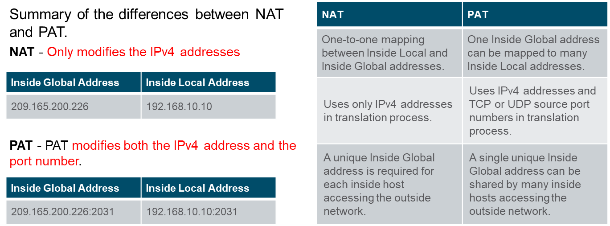
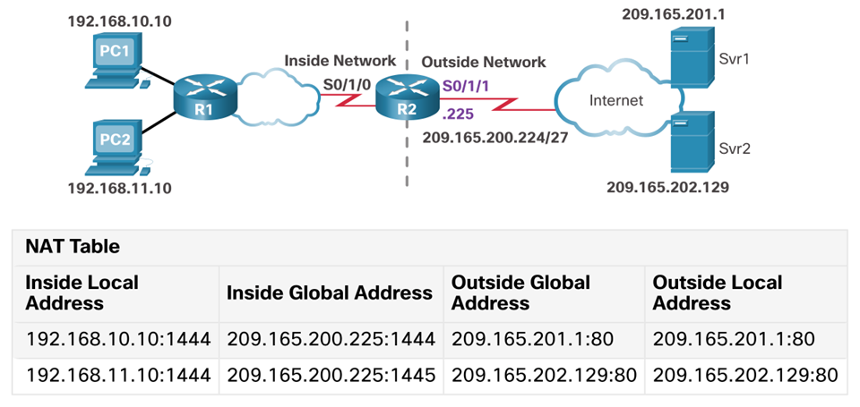

# ENSA Module 6: NAT for IPv4

## 6.1 NAT Characteristics

Network address translation

### Why NAT Exists

- Primairily used to **conserve public IP addresses**.
- Networks are commonly implemented with **private IP addresses**.
- IPv4 address exhaustion led to the need for mechanisms like NAT.
- **Private IPs** allow enterprises to deploy **internal networks** without needing public IPs.
- NAT allows **internal clients** to reach the internet while **hiding** the real internal network structure.

### RFC 1918 - Private IP Address Spaces

- **10.0.0.0/8** (Class A)
- **172.16.0.0/12** (Class B)
- **192.168.0.0/16** (Class C)

These IP addresses **cannot be routed** directly on the public Internet.

---

### Detailed NAT Operation (Packet Flow)

When an internal device initiates traffic to the internet:

1. Packet is sent with **source IP = private IP**, **destination IP = public server**.
2. Router with NAT inspects the packet:
   - Matches source IP to an inside local address.
   - Assigns a public IP (inside global).
   - Records the mapping in the **NAT translation table**.
3. Router rewrites packet:
   - Changes **source IP** to inside global address.
   - Leaves **destination IP** unchanged.
4. Packet is forwarded to the public network.
5. Response from the public server:
   - Destination IP is the inside global address.
6. Router checks NAT table:
   - Finds the original inside local mapping.
   - Rewrites the destination IP back to the original private IP.
7. Packet is forwarded internally.

---

### Critical NAT Terminology

| NAT Term           | Detailed Meaning                                                                      | Key Example                       |
| :----------------- | :------------------------------------------------------------------------------------ | :-------------------------------- |
| **Inside Local**   | The private source IP assigned to a host inside the network.                          | `192.168.10.10`                   |
| **Inside Global**  | The public IP assigned to the same internal device, visible to the outside world.     | `209.165.200.226`                 |
| **Outside Global** | The public IP address of the external destination (e.g., a web server).               | `209.165.201.1`                   |
| **Outside Local**  | The destination IP address as seen internally (rarely different from outside global). | Typically same as outside global. |

---


---

# 6.2 Types of NAT

---

### Static NAT

- **Manual 1:1 mapping** between a private IP and a public IP.
- Every internal device has a **fixed public IP**.
- Consistent translation — IP never changes.
- Used for:

  - Internal servers needing **inbound access** from the internet (e.g., email servers, web servers).
  - Devices that need to be **reached** from outside.

  **Key Considerations**:

- **Public IPs must be sufficient** for every device that needs static mapping.
- If a public IP address changes, it must be manually updated.


---

### Dynamic NAT

- **Dynamically** assigns a public IP from a **predefined pool** when needed.
- Mapping is **temporary** and exists only during the session.
- Once the session is finished, the IP is **returned to the pool**.
- Configured with:

  - A **pool of public IPs**.
  - An **access control list (ACL)** to define which inside IPs are eligible.

  **Key Characteristics**:

- Still requires **enough public IPs** for concurrent users.
- **First-come, first-served** basis — if all public IPs are used, new sessions fail.


---

### PAT (Port Address Translation) / NAT Overload

- **Many-to-one** or **many-to-few** mappings.
- All inside hosts share **one or a few public IPs**.
- When a device wants to connect to the internet, it sends traffic to the router.
- The router changes the source IP address from the private IP to the router's public IP.
- Since many devices can be using the same public IP at the same time, PAT assigns a unique port number to each connection.
- The router keeps a translation table mapping internal IP:port to public IP:port

  **How PAT works under the hood**:

- Each internal session gets a **unique source port number** at the NAT router.
- NAT builds a table based on:

  - **Inside Local IP:Port** ↔ **Inside Global IP:Port**.

  **Real-world behavior**:

- Thousands of internal clients can connect simultaneously using **one public IP**.
- Source ports are carefully selected to avoid collisions. If a collision occurs, a new port is picked.

| Feature                      | NAT     | PAT       |
| :--------------------------- | :------ | :-------- |
| Address translation only     | ✅      | 🚫        |
| Address and port translation | 🚫      | ✅        |
| Public IP conservation       | Limited | Excellent |




---

# 6.3 Advantages and Disadvantages of NAT

---

### Advantages

- **Address conservation**: Reuses private IPs internally.
- **Flexibility**: Changing ISPs only requires modifying NAT settings, not internal IPs.
- **Security by obscurity**: Internal network structure is hidden from outsiders.
- **Port multiplexing**: Multiple connections over single public IP (via PAT).

---

### Disadvantages

- **Performance overhead**: Packets must be modified → slight delays. -> Forwarding delay.
- **Breaks end-to-end principle**:
  - NAT complicates or breaks protocols like **IPsec VPNs**, **SIP VoIP**, and **peer-to-peer** apps. (No end to end connections)

---

# 6.4 Static NAT - Full Details

---

### Use Cases

- External services (e.g., web, mail servers).
- Remote access to internal hosts.

---

### Static NAT Packet Flow

- Internal server sends or receives packets.
- Router always maps internal IP to static global IP.
- No dynamic lookup — translation is preconfigured.
- Allows external to intiate connections to internal servers.

---

### Verification Tools

- `show ip nat translations` — Static mappings are **always listed**, even if no traffic is present.
- `show ip nat statistics` — Tracks hits, misses, active translations.

---


---

# 6.5 Dynamic NAT - Full Details

**Dynamic NAT automatically maps inside local addresses to inside global addresses.**

Not directly accessible from the outside world.

- Internal clients initiate connections to the internet.
- NAT router pool empty => device has to wait for a public IP to become available.

---

### Dynamic NAT Workflow

1. Packet from internal device arrives at NAT router.
2. ACL determines eligibility for NAT.
3. If eligible:
   - A public IP is dynamically selected from the pool.
   - Mapping recorded in NAT table. (Transaltion entry)
4. Packet source IP is translated.
5. When the session ends (timeout or connection close):
   - Mapping is deleted.
   - IP is returned to the pool.


### Dynamic NAT Key Points

- **Stateful** — Requires router memory to track active translations.
- Mapping disappears once session ends or expires.
- **Verification commands**: `show ip nat translations`, `show ip nat statistics`.

- **Timeouts**: Default is 24 hours, but can be adjusted.

---

# 6.6 PAT (Overload) - Full Details

---


PAT Can be used with more than one public IP address.

Its called overloading because it overloads the public IP address with many private IP addresses.

- **Many-to-one** mapping of private IPs to a single public IP.

### How PAT Handles Collisions

- If the same port is already used for another session, PAT **finds an unused port**.
- If **all ports are exhausted** (rare in large NAT pools), new sessions are dropped.

### PAT working

```
1.PC1 and PC2 send packets to Svr1 and Svr2.
2.The packet from PC1 reaches R2 first. R2 modifies the source IPv4 address to 209.165.200.225 (inside global address). The packet is then forwarded towards Svr1.
3.The packet from PC2 arrives at R2. PAT changes the source IPv4 address of PC2 to the inside global address 209.165.200.225. PC2 has the same source port number as the translation for PC1. PAT increments the source port number until it is a unique value in its table. In this instance, it is 1445.
4. The servers use the source port from the received packet as the destination port, and the source address as the destination address for the return traffic.
5. R2 changes the destination IPv4 address of the packet from Srv1 from 209.165.200.225 to 192.168.10.10, and forwards the packet toward PC1.
6. R2 changes the destination address of packet from Srv2. from 209.165.200.225 to 192.168.11.10. and modifies the destinations port back to its original value of 1444. The packet is then forwarded toward PC2.
```


### PAT Internal Tables

PAT tracks each translation with 5-tuple information:

- Source IP
- Source Port
- Destination IP
- Destination Port
- Protocol (TCP/UDP)

This allows PAT to **multiplex thousands of sessions**.

---

### PAT Special Behaviors

- Some legacy applications **hard-code** specific source ports. PAT must adjust mappings dynamically.
- When NAT is overwhelmed (e.g., gaming servers, heavy UDP use), NAT "pinhole" techniques or firewall rules are required.

---

# 6.7 NAT64 for IPv6

---

### Role of NAT64

- Bridges communication between **IPv6** and **IPv4** networks.
- Typically used with **DNS64**, which synthesizes fake AAAA records pointing to NAT64 gateway.


---

### NAT64 Important Notes

- IPv6 was developed with the intention of making NAT for IPv4 with translation between public and private IPv4 addresses unnecessary.
- NOT meant to allow private IPv6 to public IPv6 translations.
- Temporary solution until full IPv6 adoption. Aids in the transition from IPv4 to IPv6.
- Adds **protocol translation overhead** (IPv6 ↔ IPv4).

---

### DIFFERENCE NAT incomming and outgoing connections

### **1. Static NAT (One-to-One)**

#### **Outgoing**:

- Internal device uses a fixed public IP.
- Easy and predictable — outbound traffic just uses the mapped public IP.

#### **Incoming**:

- Works well — external devices can reach the internal host **because the public IP is always mapped to the same private IP**.
- Ideal for hosting web, mail, or game servers.

  **Best for incoming connections**.

---

### **2. Dynamic NAT (Many-to-Many)**

#### **Outgoing**:

- Private IP is mapped to a random available public IP from a pool.
- Works fine **as long as a public IP is available**.

#### **Incoming**:

- Not reliable — the mapping changes and **you can't predict which internal device has which public IP**.
- Generally **not used for hosting services**.

  **Poor for incoming connections**.

---

### **3. PAT / NAT Overload (Many-to-One)**

#### **Outgoing**:

- Many internal devices share one public IP, differentiated by port numbers.
- Works very well — very common for internet access.

#### **Incoming**:

- ❌ Doesn't work unless you **manually configure port forwarding** (e.g., forward port 80 to internal IP 192.168.1.10).
- Because many devices use the same public IP, the router can't know which internal device an incoming connection is meant for **unless specified**.

⚠️ **Incoming only works with port forwarding**.
