# SRWE Module 10: LAN Security Concepts

## **10.1 Endpoint Security**

### Modern Network Threats:

- **DDoS (Distributed Denial of Service)**: Uses zombie devices to overwhelm services (web, DNS, etc.) via massive traffic, disrupting access. Degrading or halting public access.
- **Data Breach**: Unauthorized access to sensitive data (customer records, trade secrets); Stealing of an organization's confidentials data.
- **Malware**: Includes viruses, worms, spyware, ransomware. **WannaCry** encrypts files and demands payment. Often enters via phishing emails or malicious downloads. Infects hosts and spreads to others.

### Security Devices at Network Edge:

- **VPN-Enabled Router**: Provides secure remote access to the internal network and on public networks. VPN can be integrated into the firewall.
- **NGFW (Next-Generation Firewall)**:
  - **Stateful packet inspection**: Tracks active sessions.
  - **Application visibility**: Identifies app-layer traffic (e.g., Skype, Facebook).
  - **NGIPS**: Next Generation Intrusion Prevention System.
  - **AMP**: Advanced Malware Protection.
  - **URL filtering**: Blocks harmful domains.
- **NAC (Network Access Control)**:
  - Manages **AAA** (Authentication, Authorization, Accounting).
  - Controls user/device access based on posture (e.g., device type, compliance).
  - Policy based: Enforces security policies based on user/device attributes.
  - Example: Cisco ISE enforces access policies dynamically.

### Endpoint Protections:

- **Endpoints** = Laptops, phones, printers, IP phones, BYOD.
- Vulnerable to email/web-borne malware (common initial attack vector).
- Traditional tools: Antivirus, host-based firewalls, HIPS (Host Intrusion Prevention System).
- **Modern endpoint protection stack**:
  - **NAC**: Network Access Control (e.g., Cisco ISE).
  - **AMP (Cisco or other)**: Advanced Malware Protection.
  - **ESA (Email Security Appliance)**
  - **WSA (Web Security Appliance)**

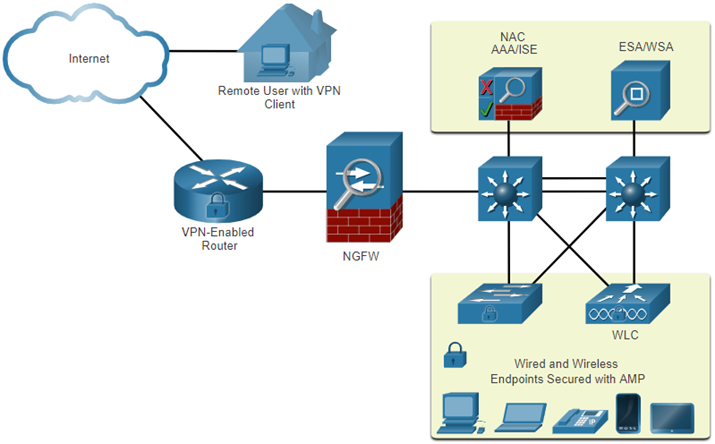

### Cisco Email Security Appliance (ESA):

- Monitors **SMTP traffic**.
- Uses **Cisco Talos** feeds for live updates (every 3–5 mins).
- Functions:
  - Block known threats
  - Detect stealth malware (e.g., polymorphic)
  - Filter malicious links
  - Prevent access to newly infected sites
  - Encrypt outbound content to avoid **data loss**

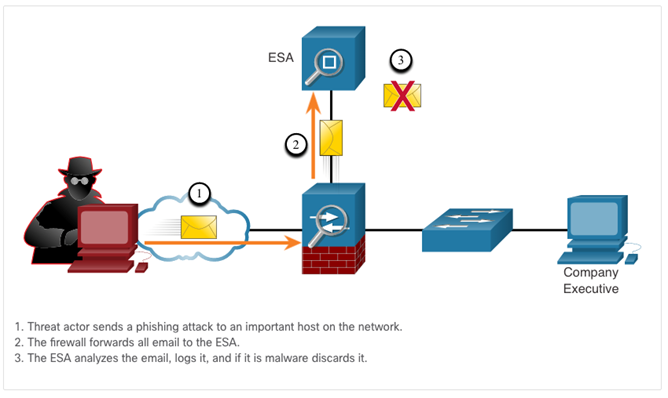

### Cisco Web Security Appliance (WSA):

- Protects web access; sits in path of user → internet.
- Capabilities:
  - Malware scanning
  - URL categorization + blacklisting
  - Control user access to web services (e.g., allow YouTube, block adult content)
  - Inspect encrypted traffic (SSL/TLS)
  - Enforce **acceptable use policies** (by user, time, app)

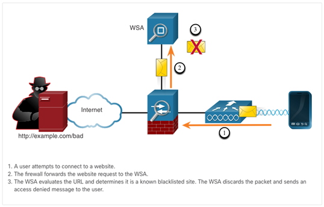

## **10.2 Access Control**

### Authentication Methods:

- **Console/VTY/AUX passwords**: Basic, no encryption. A password can be set
- **SSH**: Secure remote access with encrypted credentials.
- **Local database**: User credentials stored on each device.
  - Good for small-scale use only.
  - **Not scalable**, no centralized management or fallback.

### AAA (Authentication, Authorization, Accounting):

- **Authentication**: Verifies identity (who).
- **Authorization**: Defines permissions (what they can do).
- **Accounting**: Logs activity (what they did).

### AAA Authentication Methods:

- **Local**:

  - Usernames/passwords stored on local device.
  - Simple but manual; best for small networks.

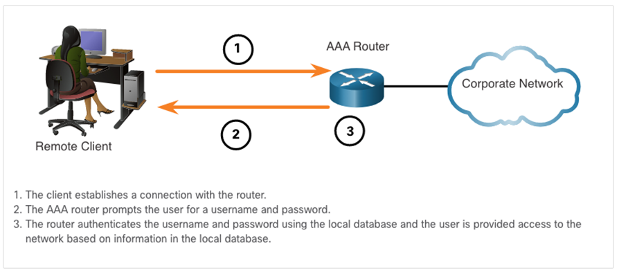

- **Server-Based**:
  - Centralized database (e.g., RADIUS or TACACS+ server).
  - Better scalability and security. When using multiple routers and switches, it is easier to manage a single server than multiple local databases.
  - 2 Protocols:
    - **Remote Authentication Dial-In User Service RADIUS**
    - **Terminal Access Controller Access Control System TACACS+**

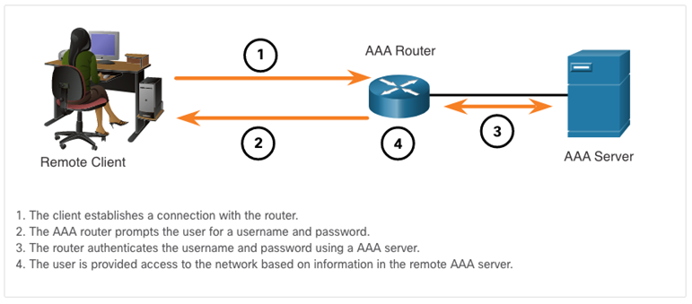

### Authorization:

- Authorization is automatically performed after authentication. Does not require user input.
- Authorization governs what user can and cannot do on the network.
- Uses a set of attributes that describes the users and their access to the network.
- These attributes are used by the AAA server to determine the privileges and restrictions of the user.

### Accounting:

- Collects and reports usage data.
- Tracks:
  - Connection times
  - Commands entered (especially config mode)
  - Byte/packet counters
- Useful for audits, forensics, and billing.
- The AAA server keeps track of the user’s activity and logs it for later review. Including all commands entered by the user.

### IEEE 802.1X Authentication:

- This protocol restricts unauthorized workstations from connecting to a LAN through publicly accessible switch ports.
- **Port-based control**: Blocks network access until device is authenticated.
- **Roles**:
  - **Supplicant**: The client (e.g., laptop) with 802.1X agent.
  - **Authenticator**: Switch or AP controlling port access.
  - **Authentication Server**: Validates identity (e.g., RADIUS).

## 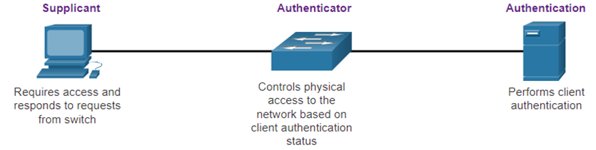

## **10.3 Layer 2 Security Threats**

### Why Layer 2 is Critical:

- Often overlooked, but fundamental. A compromise here compromises all upper-layer defenses (VPN, firewall, etc.).
- LANs now host **untrusted** devices (BYOD, guests), making Layer 2 security essential.

### Switch attack categories:

- Security is only as strong as the weakest link in the system, and Layer 2 is considered to be that weak link.

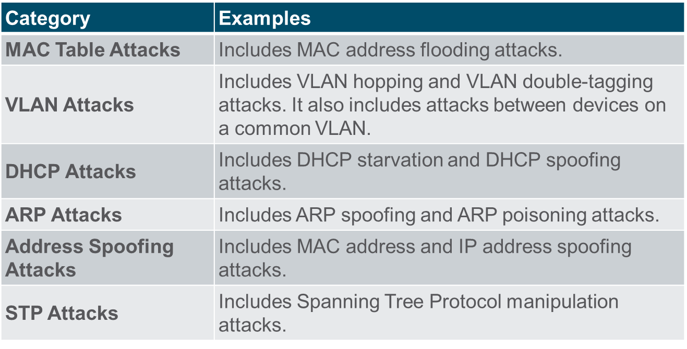µ

### Switch attack mitigation techniques:

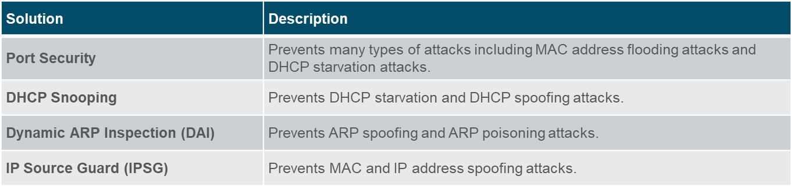

These layer 2 solutions will not be effective if the management protocols are not secured.

- Always use secure management protocols SSH, SFTP, SCP, SSL, ...
- Consider using a dedicated management VLAN for management traffic.
- Consider using out-of-band management network to manage devices.
- Use ACL's to filter unwanted access.

---

## **10.4 MAC Address Table Attack**

### MAC Table Operation:

- Switch learns MACs from source addresses of frames.
- Maps MACs to ports → enables efficient forwarding.

### MAC Flooding Attack:

- Attacker floods switch with thousands of fake source MACs.
- When the MAC table is full the switch will start to act like a hub. Meaning it will flood all traffic to all ports.
- This allows the attacker to sniff traffic from other devices on the same VLAN. Since everything is being flooded to all ports.

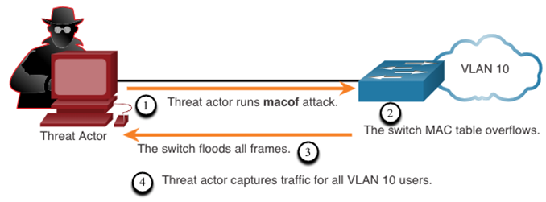

### Impact:

- Breaks confidentiality.
- Affects local VLAN only, but can cascade to other switches if flooded traffic propagates.

### Mitigation:

- **Port Security**:
  - Limits # of allowed MACs per port.
  - Can shut down, restrict, or protect if limit is exceeded.

---

## **10.5 LAN Attacks**

### VLAN Hopping Attacks:

#### Classic VLAN Hopping:

- Host pretends to be a switch.
- Spoofs **DTP and 802.1Q** to force trunking. Automatically negotiate trunking with the switch.
- Gains access to **all VLANs** on the trunk. And can send and receive traffic from all VLANs.

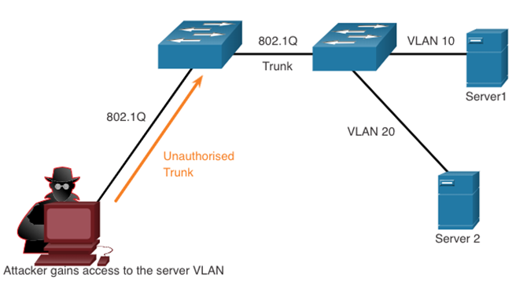

#### Double-Tagging:

- Sends frame with **two VLAN tags**:
  - Outer tag = native VLAN (gets stripped at first switch).
  - Inner tag = target VLAN.
- Second switch forwards to target VLAN.
- Works **only when attacker is on native VLAN**.
- Unidirectional attack: Attacker can send traffic to target VLAN, but not receive it.

**Mitigation**:

- Disable trunking on access ports (`switchport mode access`).
- Manually configure trunk ports. No automatic negotiation.
- Use dedicated VLAN for native VLAN, not shared with users.

### DHCP Attacks:

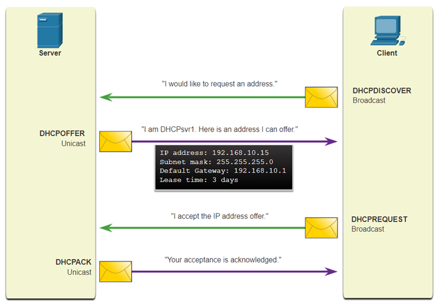

#### Starvation:

- Attacker uses tools (e.g., **Gobbler**) to lease all IPs using fake MACs.
- Creates DHCP discovery messages with bogus MAC addresses
- Causes **DoS** for legitimate users.

#### Spoofing:

- Rogue DHCP server provides incorrect:
  - Gateway IP → MITM
  - DNS IP → redirect to malicious sites
  - Client IP → invalid IPs (DoS)

### ARP Attacks:

#### Spoofing/Poisoning:

- Attacker sends **gratuitous ARP** replies linking their MAC to gateway IP.
- Creates **MITM** position.
- IPv6 uses **Neighbor Discovery Protocol (NDP)** instead of ARP. Which has built-in security features.

**Mitigation**:

- **DAI (Dynamic ARP Inspection)**:
  - Validates ARP packets against DHCP Snooping table.

### Address Spoofing:

- **IP Spoofing**: Uses a valid or fake IP to evade security.
- **MAC Spoofing**: Forwards traffic intended for another device.

**Mitigation**:

- **IP Source Guard (IPSG)**:
  - Matches MAC/IP against DHCP snooping database.
  - Blocks unverified hosts.

### STP Attack:

- Broadcasts **BPDUs** with low priority to become root bridge.
- Changes traffic paths → intercepts traffic. MITM.

**Mitigation**:

- Enable **BPDU Guard**:
  - Disables port if BPDU is received unexpectedly (e.g., on access port).

### CDP Reconnaissance:

- **CDP (Cisco Discovery Protocol)**:
  - Periodic, unencrypted, unauthenticated broadcast.
  - Reveals IP, OS version, VLAN info → used for further attacks.

**Mitigation**:

- Disable CDP on untrusted ports or globally (`no cdp run`).
- **LLDP** (Link Layer Discovery Protocol) should also be disabled on edge interfaces.
