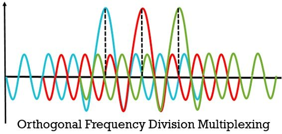

# SRWE Module 12: WLAN Concepts

## 12.1. **Introduction to WLANs**

- WLANs extend Layer 2 access to users via **radio frequency (RF)** instead of copper or fiber cabling.
- Provide **mobility**, **flexibility**, and **cost-effective deployment**, particularly in dynamic or mobile environments.
- Operate over the **OSI Layer 1 (Physical)** and **Layer 2 (Data Link)** layers with adaptations for wireless media.

### Types of WLANs:

- WPAN (Wireless Personal Area Network): Short-range, low-power (e.g., Bluetooth). 802.15
- WLAN (Wireless Local Area Network): Medium-range, higher bandwidth (e.g., Wi-Fi). 802.11
- WMAN (Wireless Metropolitan Area Network): Covers larger areas (e.g., WiMAX (Worldwide Interoperability for Microwave Access)).
- WWAN (Wireless Wide Area Network): Extensive geographic coverage (e.g., cellular networks, satellite).

### Wireless Technologies:

- Bluetooth: Short-range, low-power, peer-to-peer connections.
- WiMAX: Long-range, high-speed broadband access. Worldwide Interoperability for Microwave Access. 802.16 50KM
- Cellular: Wide area coverage using base stations; includes 3G, 4G, and 5G technologies. Caries both voice and data.
  - GSM (Global System for Mobile Communications): 2G technology for voice and SMS.
  - CDMA (Code Division Multiple Access): US
- Satellite: Global coverage, used for remote areas and maritime applications.

### Major IEEE Standards:

| Standard           | Band      | Modulation      | Max Data Rate | Key Features                                |
| ------------------ | --------- | --------------- | ------------- | ------------------------------------------- |
| 802.11a            | 5 GHz     | OFDM            | 54 Mbps       | Shorter range, less interference            |
| 802.11b            | 2.4 GHz   | DSSS            | 11 Mbps       | Legacy; highly prone to interference        |
| 802.11g            | 2.4 GHz   | OFDM            | 54 Mbps       | Backward compatible with 802.11b            |
| 802.11n            | 2.4/5 GHz | OFDM + MIMO     | 600 Mbps      | Channel bonding (20/40 MHz), MIMO           |
| 802.11ac           | 5 GHz     | OFDM + MU-MIMO  | \~6.9 Gbps    | Wider channels (up to 160 MHz), beamforming |
| 802.11ax (Wi-Fi 6) | 2.4/5 GHz | OFDMA + MU-MIMO | 9.6 Gbps      | Improved efficiency, latency, capacity      |

---

## 12.2 **WLAN Components**

- Wireless NIC (Network Interface Card): Hardware that enables devices to connect to WLANs. Integrated radio transceiver.
- Wireless Access Point (AP): Connects wireless clients to the wired network. Acts as a bridge between wired and wireless networks.
  - Advertises SSID (Service Set Identifier) for client discovery.
  - CLients associate and authenticate with the AP.

### AP Modes:

- Autonomous: Standalone APs with self-management.
  - Operate independently, no controller required.
  - Configured via web interface or CLI.
- Controller-based:
  - APs managed by a Wireless LAN Controller (WLC) for centralized control and configuration.
  - LAP's (Lightweight Access Points) rely on WLC for management.
  - LWAPP (Lightweight Access Point Protocol) used for communication between APs and WLC.
  - WLC uses LAG (Link Aggregation Group) for redundancy and load balancing.

### Antenna Types:

- **Omnidirectional**: Radiates signal equally in all directions; ideal for general coverage.
- **Directional**: Focuses signal in a specific direction; used for point-to-point links or long-range connections.
- **MIMO (Multiple Input Multiple Output)**: Uses multiple antennas to improve signal quality and data rates; common in modern WLANs.

## 12.3. **WLAN Operation**

### Wireless Topology Modes:

- Ad-hoc (IBSS): Peer-to-peer connections without APs. (Independent Basic Service Set)
- Infrastructure: Clients connect to an AP, which connects to the wired network. (Basic Service Set)
- Thethering: Connects a device to a network via another device (e.g., smartphone hotspot).

### BSS (Basic Service Set):

- Basic unit of a WLAN; consists of an AP and associated clients.
- Each BSS has a unique **BSSID** (Basic Service Set Identifier), typically the MAC address of the AP.
- **BSA** (Basic Service Area): Physical area covered by a BSS.
- Without intermediate system different BSSs can not communicate with each other.

### ESS (Extended Service Set):

- Multiple BSSs interconnected via a distribution system (DS).
- Allows seamless roaming between APs within the same ESS.
- Each ESS has a unique **SSID** (Service Set Identifier), which is the network name broadcasted by APs.µ
- **ESA** (Extended Service Area): Physical area covered by an ESS.

### CSMA/CA (Carrier Sense Multiple Access with Collision Avoidance):

- Wireless networks are half-duplex; only one device can transmit at a time.
- CSMA/CA uses a **contention-based** approach to avoid collisions.

1. **Listen**: Device listens for a clear channel before transmitting.
2. Sends a **Request to Send (RTS)** frame to the AP.
3. AP responds with a **Clear to Send (CTS)** frame.
4. If no CTS is received, the device waits a random backoff time before retrying.
5. Transmits data
6. Receives an **ACK** (Acknowledgment) frame from the AP to confirm successful transmission.
7. If no ACK is received, the device assumes a collision occurred and retries.

### Wireless client and AP association:

- Clients must associate with an AP to communicate.

3 Steps:

- Discover AP
- Autheneticate with AP
- Associate with AP

To Achieve association, clients must:

- Match the AP's SSID and security settings.
- Support the same frequency band (2.4 GHz or 5 GHz).
- have the same channel settings
- Have the same network mode
- Have the correct password

### AP Discovery:

CLients can connect to an AP using passive or active scanning / probing.

- **Passive Scanning**: Clients listen for beacon frames broadcasted by APs. Beacon frames contain information about the AP, including SSID, supported data rates, and security settings.
  
- **Active Scanning**: Clients must know the SSID of the AP they want to connect to. They send a probe request frame to the AP, which responds with a probe response frame containing information about the AP.
  

---

## 12.4. **CAPWAP Operation**

- **Control and Provisioning of Wireless Access Points (CAPWAP)**: Protocol for communication between lightweight APs and WLC.
- IEEE Standard

- Based on **LWAPP** (Lightweight Access Point Protocol) but with added security => DTLS (Datagram Transport Layer Security) for encryption.
- CAPWAP encapsulates data frames in a tunnel between the AP and WLC, UDP port 5246 and 5247.

### Split MAC Architecture:

- CAPWAP seperates the functions of the WLC AND AP and sends them to the correct respective device.:
  

### DTLS (Datagram Transport Layer Security):

- Provides encryption and integrity for CAPWAP control messages.
- DATA frames are not encrypted by default, but can be if configured. => License required.
- CONTROL messages are encrypted to protect sensitive information (e.g., authentication credentials).

### Flex Connect APs:

- Operate in both local and remote modes when CAPWAP is used.
- This enables APs to function independently when the WLC is unreachable.

- **Local Mode**: APs connect to WLC for configuration and control.
- **Remote Mode**: APs operate independently, allowing local clients to connect even if the WLC is unreachable. (Switching and client authentication are done locally)
  

---

## 12.5. **Channel Mangement**

- If demand for a specific channel is high, the channel may become saturated, leading to performance degradation.

### Channel saturation can be mitigated by:

- **Direct-Sequence Spread Spectrum (DSSS)**: Spreads the signal over a wider frequency range, reducing interference.

- **Orthogonal Frequency Division Multiplexing (OFDM)**: Divides the signal into multiple subcarriers, each of these subcarriers is modulated with a low data rate signal. This allows for higher data rates and better resistance to interference. The subcarriers are orthogonal to each other, meaning they do not interfere with each other.

- **Frequency Hopping Spread Spectrum (FHSS)**: Rapidly changes frequencies to avoid interference. Sender and receiver must be synchronized to the same hopping pattern.

### 2.4 GHz Considerations:

- Channels overlap significantly; use only 1, 6, 11 in most countries.
- Affected by **microwaves**, **Bluetooth**, **cordless phones**.
- For neigboring APs, use **non-overlapping channels** to minimize interference. Meaning each AP should use a different channel than the others. For example, if AP1 is on channel 1, AP2 should be on channel 6 or 11.
- A channel width of 22 MHz and are seprated by 5 MHz.

### 5 GHz Considerations:

- Offers 24 non-overlapping channels.
- The tails of the channels overlap, but the center frequencies do not.
- Channels are 20 MHz wide and separated by 20 MHz.

### Best Practices:

- **Minimize co-channel interference** by using non-overlapping channels.
- Use **site survey tools** to visualize and select optimal channels.
  need for non-overlapping chanels made visible by the picture

---

## 12.6. **WLAN Threats**

WLAN is open to anyone within range of an AP and is vulnerable to various attacks.

### DOS (Denial of Service):

- Attackers flood the network with traffic, overwhelming APs and causing service disruption.
- Can be mitigated by implementing **rate limiting** and **traffic shaping** on APs.

### Rogue APs:

- Unauthorized APs connected to the network, potentially compromising security.
- Can be set up by employees or attackers to bypass security controls.
- Can be used for a Man-in-the-Middle (MitM) attack.
- Configure WLC to detect rogue APs and alert administrators.

### Interception of data:

- All traffic is sent in the clear, making it vulnerable to eavesdropping. It should be encrypted.

---

## 12.7. **Secure WLAN's**

In the early days SSID cloaking and MAC address filtering were used to secure WLANs, but these methods are no longer considered effective enough.

### SSID Cloaking:

- Hides the SSID from casual users. (passive mode)

### MAC Address Filtering:

- Allows only specific MAC addresses to connect to the AP.

Best way to secure a wireless network is to use encryption and authentication protocols.
2 Types:

- Open system authentication: No encryption, no authentication. => requires other security measures.
- Shared key authentication: Uses a shared key for authentication and encryption.
  - WPA, WPA2, and WPA3 are the most common encryption protocols used in WLANs.

### Authenticating a home user:

- WPA2-Personal: Uses a pre-shared key (PSK) for authentication. => The password
- WPA32 Enterprise: Uses 802.1X authentication with a RADIUS server for enterprise environments. (Remote authentication dial-in user service)
  - Uses the EAP (Extensible Authentication Protocol) for authentication.

### Encryption methods:

- TKIP (Temporal Key Integrity Protocol): Used in WPA, provides per-packet keying and message integrity.
- AES (Advanced Encryption Standard): Used in WPA2 and WPA3, provides stronger encryption and is the industry standard.
  - AES-CCMP (Counter Mode with Cipher Block Chaining Message Authentication Code Protocol): Used in WPA2, provides confidentiality and integrity. Can sense when the data is being tampered with.

### Authenticating an entherprise user

Enterprise security mode choice requires an **Authentication, Authorization, and Accounting (AAA) RADIUS server.**

- **Authentication**: Verifies user credentials (username/password).
- **Authorization**: Determines user access rights and permissions.
- **Accounting**: Tracks user activity and resource usage.

Radius uses a shared key to authenticate the AP with the RADIUS server.

### WPA3

Because WPA2 is no longer considered secure, WPA3 is recommended when available. WPA3 Includes four features:

- WPA3 – Personal : Thwarts brute force attacks by using Simultaneous Authentication of Equals (SAE).
- WPA3 – Enterprise : Uses 802.1X/EAP authentication. However, it requires the use of a 192-bit cryptographic suite and eliminates the mixing of security protocols for previous 802.11 standards.
- Open Networks : Does not use any authentication. However, uses Opportunistic Wireless Encryption (OWE) to encrypt all wireless traffic.
- IoT Onboarding : Uses Device Provisioning Protocol (DPP) to quickly onboard IoT devices.
