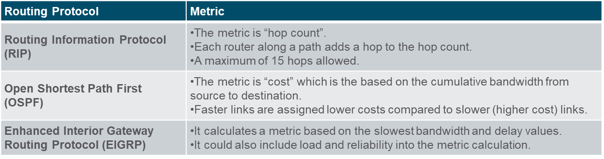

# Module 14: Routing Concepts

## Path Determination

When a router receives a packet on an interface it has to determine what interface to forward it to. **This is Routing.** The interface that the router used for forwarding the packet is called the **next hop** and may or may not be the final destination of the packet.

2 Functions of a Router:

- **Determine the best pat**h to a destination -> Routing table
- **Forward packets** to the next hop/destination

### What Does "Longest Match" Mean?

When a router receives a packet, it checks the **destination IP address** against its routing table. Each entry in the routing table specifies a destination network, defined by:

1. **Network address** (e.g., `192.168.1.0`)
2. **Subnet mask** or **prefix length** (e.g., `/24` for `192.168.1.0/24`).

The **longest match rule** means that the router selects the route with the **most specific prefix** that matches the destination IP address. A "longer" prefix length corresponds to a smaller network and a more specific match.

#### Example

Suppose a router has the following routing table:

| Network Prefix | Prefix Length | Next Hop |
| -------------- | ------------- | -------- |
| 192.168.0.0    | /16           | Router A |
| 192.168.1.0    | /24           | Router B |
| 192.168.1.128  | /25           | Router C |

And a packet arrives with the destination IP: `192.168.1.130`.

1. The router evaluates the routing table:

   - `192.168.0.0/16` matches because the first 16 bits are the same.
   - `192.168.1.0/24` matches because the first 24 bits are the same.
   - `192.168.1.128/25` matches because the first 25 bits are the same.

2. The **longest match** is `192.168.1.128/25` because it has the greatest prefix length (25 bits).

3. The router forwards the packet to **Router C**, associated with the longest match.

#### Example Scenario with Binary Representation

##### Routing Table Entries

| **Network Prefix** | **Prefix Length** | **Binary Representation of Network Prefix** |
| ------------------ | ----------------- | ------------------------------------------- |
| `192.168.0.0/16`   | 16 bits           | `11000000.10101000.00000000.00000000`       |
| `192.168.1.0/24`   | 24 bits           | `11000000.10101000.00000001.00000000`       |
| `192.168.1.128/25` | 25 bits           | `11000000.10101000.00000001.10000000`       |

##### Destination IP Address

Suppose a packet arrives with the destination IP address: `192.168.1.130`.

**Binary Representation of Destination IP:**  
`192.168.1.130` = `11000000.10101000.00000001.10000010`

---

#### Step-by-Step Routing Decision:

1. **Match with `192.168.0.0/16`:**

   - Prefix: `11000000.10101000.00000000.00000000`
   - Mask: `11111111.11111111.00000000.00000000` (16 bits)
   - Compare the **first 16 bits** of the destination IP with the prefix:
     ```
     11000000.10101000.00000001.10000010  (Destination IP)
     11000000.10101000.00000000.00000000  (Network Prefix)
     -----------------------------------
     Match: First 16 bits match.
     ```
   - This route is valid but not the most specific match.

2. **Match with `192.168.1.0/24`:**

   - Prefix: `11000000.10101000.00000001.00000000`
   - Mask: `11111111.11111111.11111111.00000000` (24 bits)
   - Compare the **first 24 bits** of the destination IP with the prefix:
     ```
     11000000.10101000.00000001.10000010  (Destination IP)
     11000000.10101000.00000001.00000000  (Network Prefix)
     -----------------------------------
     Match: First 24 bits match.
     ```
   - This route is more specific than the `/16` route.

3. **Match with `192.168.1.128/25`:**
   - Prefix: `11000000.10101000.00000001.10000000`
   - Mask: `11111111.11111111.11111111.10000000` (25 bits)
   - Compare the **first 25 bits** of the destination IP with the prefix:
     ```
     11000000.10101000.00000001.10000010  (Destination IP)
     11000000.10101000.00000001.10000000  (Network Prefix)
     -----------------------------------
     Match: First 25 bits match.
     ```
   - This route is the most specific match because it matches 25 bits.

**This is also the case with ipv6 addresses. The longest match rule is used to determine the best path to a destination.**

### Building the Routing Table

The routing table is built by the router using the following methods:

1. **Directly Connected Networks:**

   - Added to the routing table automatically when an interface is configured with an IP address.

2. **Remote Networks:**

   - **Static Routing:** Manually configured by the network administrator.
   - **Dynamic Routing:** Automatically learned by routing protocols.

3. **Default Route**:
   - Default gateway -> last resort

## Packet Forwarding

1. Receive a packet on an interface. (ingress)
2. Look up the destination IP address in the routing table.
3. Determine the next hop based on the longest match rule.
4. Forward the packet to the next hop encapsulated in a new frame(router needs mac adress of destination). (egress)
5. If there is no match in the routing table, the packet is dropped.

### Forwarding mechanisms

- **Process Switching:** The router uses the CPU to process each packet. This is slow and inefficient. **Not used anymore.**

- **Fast Switching:** The router caches the next hop information for each destination in a fast-switching cache. If the destination is in the cache, the router forwards the packet without consulting the routing table. If it's not in the cache, the router performs a routing table lookup and caches the result. **Not used anymore.**

- **CEF (Cisco Express Forwarding):** The router builds a Forwarding Information Base (FIB) and an Adjacency Table. CEF uses these tables to forward packets quickly and efficiently. The table entries are not packet-triggered like fast switching but change-triggered, such as when something changes in the network topology.

## Basic Router Configuration review

- **Hostname**
- **Password**
- **Enable secret**
- **Console password**
- **VTY password**
- **Banner motd**
- **IP address on interfaces**
- **enable ipv6 routing**

## IP Routing table

> A routing table contains a list of routers to known networks.

The source of the routing table can be:

- **Directly connected networks**
- **Static routes**
- **Dynamic routing protocols**

### Routing Table Principles

- **Decisions are made alone:** Routers make decisions based on their own routing tables.
- **Each router has its own routing table:** Routers do not share routing tables. And do not match their routing tables with other routers.
- **Routing information about a patch does not provide information about the return path:** It could be a router knows how to get to a network but the return path is unknown.

### Routing Table Components

- **Router source:** Where the router learned the route.
- **Destination network:** The network address of the destination.
- **Administrative distance:** The trustworthiness of the route source. The lower the value, the more trustworthy. Based on the routing protocol.
- **Metric:** The cost of the route. The lower the value, the better the route. Calculated based on cost of a certain route.
- **Next hop:** The IP address of the next router to forward the packet to.
- **Route timestamp:** The time when the route was learned.
- **Outgoing interface:** The interface to forward the packet to.


### Directly Connected Networks

- **Directly connected networks** are networks that are connected to the router's interfaces. These are automatically added to the routing table when an interface is configured with an IP address.

Have a Status code of `C` in the routing table. Each directly connected network also has a local route `L` in the routing table.

Local routes have prefix length of `/32` for IPv4 and `/128` for IPv6. The purpose of the local route is to efficiently determine when it receives a packet for the interface instead of a packet that needs to be forwarded.

### Static Routes

**Static routing** is a method where routes are manually configured on a router. These routes define specific paths for network traffic and do not update automatically if the network changes.

#### Main Uses:

1. **Simplifies Maintenance**: Ideal for small, stable networks with minimal growth.
2. **Default Routes**: Sends traffic to unknown networks via a single path to an upstream router.
3. **Stub Networks**: Connects networks with only one connection or neighbor.


### Dynamic Routing Protocols

Dynamic routing protocols are used by routers to automatically share information about the reachability and status of remote networks. Dynamic routing protocols perform several activities, including network discovery and maintaining routing tables.


OSPF Indicated by `O` in the routing table.

**ipv6 routing protocols use the link-local address for the next hop router!**

### Default Routes

A **default route** is a route that matches all packets that do not match any other route in the routing table. It is used to forward packets to a specific router when the destination network is unknown.

Default route has route entry of **0.0.0.0/0** or **::/0**.

A default route can be either a **static** route or learned automatically from a **dynamic routing protocol**

### Administrative Distance

The **administrative distance** is a value used by routers to select the best path when there are two or more different routes to the same destination from two different routing protocols. The lower the administrative distance, the more trustworthy the route.


## Static and Dynamic Routing

Most networks use a combination of static and dynamic routing to provide the best performance and reliability.

### Static Routing

Mostlly used a default route to forward packets to the next hop router.
For routes outside the routing domain and not learned by a dynamic routing protocol.
When a admin wants to control the path a packet takes.
For routing between stub networks. (networks with only one connection to the rest of the network)

Mostly used for smaller networks.

### Dynamic Routing

Automatically learns routes and updates the routing table when the network changes. And are used when more than just a few routes are needed.

When a network is large and changes frequently.
When a change in network topology needs to be detected quickly to automatically determine another path.


A routing protocol is a set of **processes, algorithms, and messages** that are used to **exchange routing information** and populate the routing table with the choice of best paths.
The purpose of dynamic routing protocols includes the following:

- **Discovery** of remote networks
- **Maintaining** up-to-date routing information
- **Choosing the best path** to destination networks
- **Ability to find a new best path** if the current path is no longer available

Routing protocols determine the best path, or route, to each network. That route is then offered to the routing table. **The route will be installed in the routing table if there is not another routing source with a lower AD.**

A metric is the quantitative value used to measure the distance to a given network. The best path to a network is the path with the lowest metric.



### Load balancing

Load balancing is the process of distributing network traffic across multiple paths to optimize resource utilization, maximize throughput, minimize response time, and avoid network congestion.

Load balancing can be achieved by:

- **Equal-cost load balancing:** When multiple paths have the same metric, the router forwards packets over all paths. -> Over multiple interfaces.
- **Unequal-cost load balancing:** When multiple paths have different metrics, the router forwards packets over the paths with the lowest metric. -> Over a single interface. -> only supported by EIGRP.
