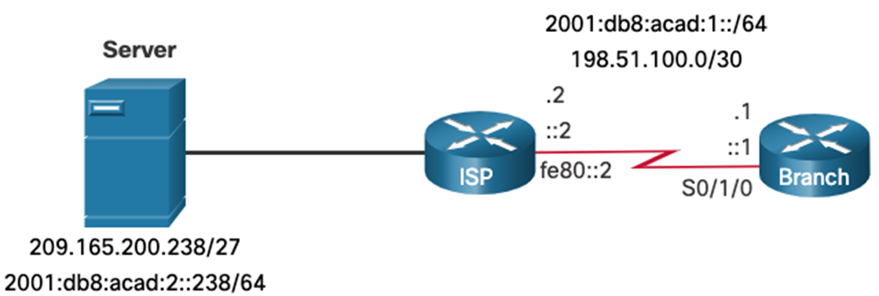

# Module 15: IP Static Routing

## Static Routes

### Types of Static Routes

- Static Standard Route
- Default Static Route
- Floating static route
- Summary Static Route

### Next-Hop Options

A static route can have one of the following next-hop options:

- Exit interface
- IP address -> **Next-hop IP address**
- Fullly specified route (IP address and exit interface)

With ipv6 if a link-local address is used as the next-hop, the exit interface must be specified.
This is because the link-local address is only unique on the local link and is not contained in the routing table.

## Configure IP static routes

See cheat sheet for configuration commands.

## Configure IP Default Static Routes

Default route is a static route that matches all packets.

used for connecting edge routers to a service provider network or a stub router.

Edge router: Router that connects an internal network to an external network. Like a router connecting an organization to the ISP.

Network address of default route is `0.0.0.0` with a subnet mask of `0.0.0.0`. Also noted as `0.0.0.0/0`. -> Quad zero route.

For ipv6 the network address is `::/0`.

## Configure Floating Static Routes


A floating static route is a backup route that only becomes active when the primary route fails. This is done by assigning it a higher administrative distance (a measure of route preference) than the primary route. Routes with lower administrative distances are preferred, so the floating static route "floats" in the background and is only used when the primary route is unavailable. By default, static routes have an administrative distance of 1, but this can be increased to make the floating route less desirable than dynamic or other static routes.

## Configure static host routes

Gets added to the routing table when an interface is configured with an IP address.

This is in addition to the connected route, designated with a C in the routing table for the network address of the interface.
The local routes are marked with L in the output of the routing table.

A host route can be a manually configured static route to direct traffic to a specific destination device, such as the server shown in the figure. The static route uses a destination IP address and a 255.255.255.255 (/32) mask for IPv4 host routes, and a /128 prefix length for IPv6 host routes.



```bash
Branch(config)# ip route 209.165.200.238 255.255.255.255 198.51.100.2
Branch(config)# ipv6 route 2001:db8:acad:2::238/128 2001:db8:acad:1::2
Branch(config)# exit
Branch#
```
